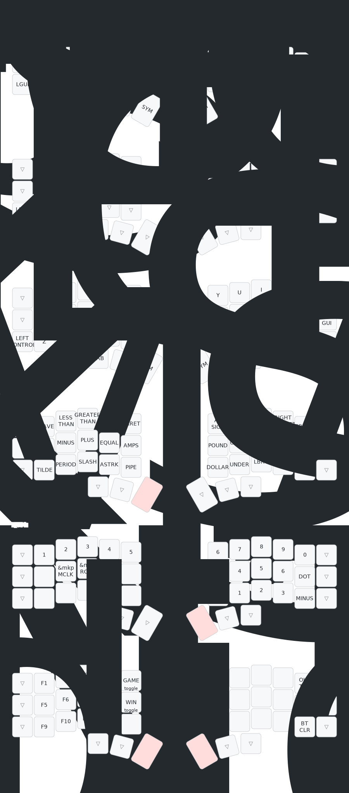

# dgct/zmk-config-corne

Personal ZMK config for Corne with trackpoint, paired with custom fork
[`dgct/zmk`](https://github.com/dgct/zmk).

## Keymap



## Local builds

Two paths:

### Path A: Nix flake (reproducible, no system pollution)

```sh
# one-time
nix develop          # or: direnv allow (uses .envrc)
just init            # west init + west update + zephyr-export

# every build
just build           # all targets in build.yaml
just build left      # filter (substring match on shield/artifact-name)
```

Outputs to `firmware/<artifact-name>.uf2`.

Inputs are pinned in `flake.lock`. Mirrors urob's `zmk-config` flake
structure (zephyr-nix + zmk-firmware/zephyr v4.1.0+zmk-fixes).

### Path B: Just + system tools (no nix)

```sh
brew install just yq cmake ninja dtc python@3.13
pip install --user west
# install zephyr-sdk-0.16 manually (https://docs.zephyrproject.org/latest/develop/getting_started/index.html)
just init
just build
```

## Recipes

```text
just              # list
just init         # west init/update/export (once per clone)
just update       # refresh modules per config/west.yml
just list         # print parsed build matrix
just build [expr] # build all (or matching) targets
just clean        # rm build/ firmware/
just clean-all    # rm build/ firmware/ + west modules
just flash <port> [side]  # 1200-baud touch + uf2 hint
just tio <port>           # serial console
```

## CI

GitHub Actions still drives the canonical builds (`.github/workflows/`).
The flake/Justfile is for local iteration only — pushing to `master`
triggers the CI matrix as before.
